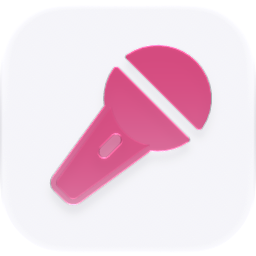
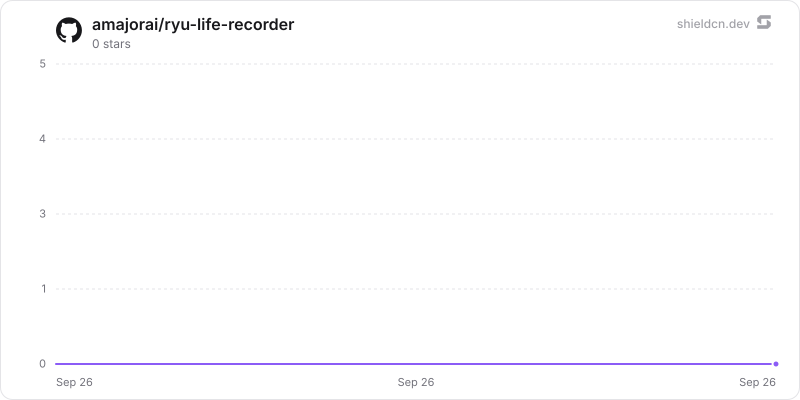

<p align="center">
  <picture>
    <source media="(prefers-color-scheme: dark)" srcset="./icon-dark.png" />
    
  </picture>
</p>

<div align="center">

# Life Recorder

</div>

Private conversation capture, Shadow speech rewind, searchable moments, and recaps.

> **The public home of `ryu-life-recorder`.** Source, builds, and releases live here —
> binaries for every platform are attached to each release.
>
> This tree is generated from the Ryu monorepo, so commits pushed here
> directly are replaced on the next sync. **Pull requests are welcome** —
> open them here and they are ported into the monorepo, then flow back out.
> Ryu as a whole: https://github.com/amajorai/ryu

## Install

**App:** [Install](ryu://apps/@ryu/life-recorder) (opens the Ryu desktop app and asks you to confirm)

**CLI:**

```bash
ryu apps add @ryu/life-recorder
```

## Source & build

This is the **source of record** for the app UI. It imports Ryu's private
`@ryu/ui` design system, so it does **not** build standalone outside the
monorepo — it **builds inside the amajorai/ryu monorepo workspace**.
The shipped bundle is the built artifact, produced by the monorepo build.

## License

Apache-2.0 — see [LICENSE](./LICENSE).

# Life Recorder

A Ryu Companion for microphone recordings, Shadow speech rewind, private
conversation transcripts, recaps, and saved moments.

The app uses the shared `media.recording`, `media.transcribe`, `timeline.transcripts`,
model, encrypted storage, and compare-and-set host contracts. It has no app-specific
Core server or separate credential store. iPhone capture belongs to Ryu's generic
native microphone module; Island reads its physical computer's Shadow with consent.

Build the self-contained Companion inside the Ryu workspace:

```sh
rtk bun run --cwd apps-store/life-recorder/ui build
rtk bun run --cwd apps-store/life-recorder/ui check-types
rtk bun test apps-store/life-recorder/ui/src
```

The manifest loads `ui/dist/index.html`. Keep generated UI artifacts in this app,
not in Core fixtures. See the [Life Recorder guide](https://docs.ryuhq.com/docs/apps/life-recorder)
for capture, retention, and surface-specific behavior.

## Star History

<a href="https://github.com/amajorai/ryu-life-recorder/stargazers">
  <picture>
    <source media="(prefers-color-scheme: dark)" srcset="./.github/shieldcn/star-chart-dark.svg" />
    
  </picture>
</a>
